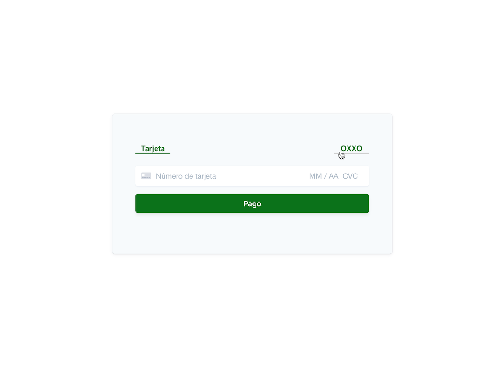

# Paying with OXXO or Cards on the web

Stripe users in Mexico can accept OXXO payments from customers in Mexico by using the Payment Intents and Payment Methods APIs. Customers pay with OXXO by providing a generated number and cash payment at an OXXO store. Stripe will notify you when the payment is completed.

OXXO is currently in private beta, only available Stripe users in Mexico. Interested in participating? Activate the payment method in your [Dashboard settings](https://dashboard.stripe.com/settings/payments).

The [PaymentIntents API](https://stripe.com/docs/api/payment_intents) supports multiple payment methods, allowing you to build a payment form that handles payment methods like OXXO alongside other methods like cards.

This sample shows how to:

- 💵💳 Accept OXXO and card payments
- 👂 Set up a webhook to listen for events
- 💁‍ Handle next actions for displaying OXXO voucher details

### Demo

<p align="center">
  
</p>

See a [hosted version](https://q66ty.sse.codesandbox.io/) of the sample or fork a copy on [codesandbox.io](https://codesandbox.io/s/stripe-sample-oxxo-payment-q66ty)

The demo is running in test mode. Use an email of the form `{any_prefix}fill_never@{any_domain}` to simulate an OXXO voucher which expires before a customer pays. Use any other email to simulate an OXXO voucher which a customer pays successfully.

Read more about testing at https://stripe.com/docs/payments/oxxo#test-integration.

## How to run locally

This sample includes 4 server implementations in Node, Ruby, Python, and PHP.

Follow the steps below to run locally.

**1. Clone and configure the sample**

The Stripe CLI is the fastest way to clone and configure a sample to run locally.

**Using the Stripe CLI**

If you haven't already installed the CLI, follow the [installation steps](https://github.com/stripe/stripe-cli#installation) in the project README. The CLI is useful for cloning samples and locally testing webhooks and Stripe integrations.

In your terminal shell, run the Stripe CLI command to clone the sample:

```
stripe samples create oxxo-payment
```

The CLI will walk you through picking your integration type, server and client languages, and configuring your .env config file with your Stripe API keys.

**Installing and cloning manually**

If you do not want to use the Stripe CLI, you can manually clone and configure the sample yourself:

```
git clone https://github.com/stripe-samples/oxxo-payment
```

Copy the .env.example file into a file named .env in the folder of the server you want to use.

```
cd oxxo-payment
cp .env.example server/<node|php|python|ruby>/.env 
```

You will need a Stripe account in order to run the demo. Once you set up your account, go to the Stripe [developer dashboard](https://stripe.com/docs/development#api-keys) to find your API keys.

```
STRIPE_PUBLISHABLE_KEY=<replace-with-your-publishable-key>
STRIPE_SECRET_KEY=<replace-with-your-secret-key>
```

Because OXXO is in private beta, you will also need to specify a Stripe API version as well as the OXXO beta version.
You can see which API version you're running at https://dashboard.stripe.com/developers.

The current OXXO beta version is v1. You can see all released versions at https://stripe.com/docs/payments/oxxo#api.

```
STRIPE_API_VERSION=<replace-with-your-api-version>
OXXO_BETA_VERSION=v1
```

`STATIC_DIR` tells the server where to the client files are located and does not need to be modified unless you move the server files.

**2. Follow the server instructions on how to run:**

Pick the server language you want and follow the instructions in the server folder README on how to run.

For example, if you want to run the Node server:

```
cd server/node # there's a README in this folder with instructions
npm install
npm start
```

**3. [Optional] Run a webhook locally:**

If you want to test with a local webhook on your machine, you can use the Stripe CLI to easily spin one up.

First [install the CLI](https://stripe.com/docs/stripe-cli) and [link your Stripe account](https://stripe.com/docs/stripe-cli#link-account).

```
stripe listen --forward-to localhost:4242/webhook
```

The CLI will print a webhook secret key to the console. Set `STRIPE_WEBHOOK_SECRET` to this value in your .env file.

You should see events logged in the console where the CLI is running.

When you are ready to create a live webhook endpoint, follow our guide in the docs on [configuring a webhook endpoint in the dashboard](https://stripe.com/docs/webhooks/setup#configure-webhook-settings).

## FAQ

Q: Why did you pick these frameworks?

A: We chose the most minimal framework to convey the key Stripe calls and concepts you need to understand. These demos are meant as an educational tool that helps you roadmap how to integrate Stripe within your own system independent of the framework.

Q: Can you show me how to build X?

A: We are always looking for new sample ideas, please email dev-samples@stripe.com with your suggestion!

## Author(s)

[@fay-stripe](https://twitter.com/mfaywu)
